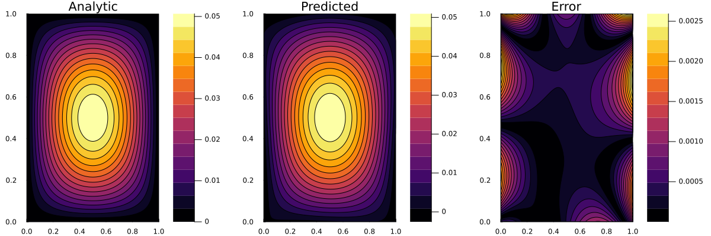

# Solving the 2D Poisson Equation using Physics-Informed Neural Networks (PINNs)

This project implements a **Physics-Informed Neural Network (PINN)** to solve the two-dimensional **Poisson equation** on a unit square domain with Dirichlet boundary conditions. The project showcases how deep learning methods can be used to solve PDEs directly by embedding physics into the loss function, without requiring explicit discretization or labeled training data.

---

## Problem Statement

The **Poisson equation** is a second-order elliptic partial differential equation widely used in physics, especially in electrostatics, fluid dynamics, and gravitational potential problems. The 2D form is:

∂²u/∂x² + ∂²u/∂y² = f(x, y)

In this example, we solve:

∂²u/∂x² + ∂²u/∂y² = -sin(πx) * sin(πy)

on the unit square domain `(x, y) ∈ [0, 1] × [0, 1]`, with homogeneous Dirichlet boundary conditions:

u(x, 0) = u(x, 1) = u(0, y) = u(1, y) = 0

The analytical solution to this problem is known:

u(x, y) = sin(πx) * sin(πy) / (2π²)

This makes it ideal for validating a PINN.

---

## What Are Physics-Informed Neural Networks (PINNs)?

**PINNs** are a neural-network-based method for solving differential equations. The key idea is to train a neural network to represent the unknown solution `u(x, y)` by minimizing a composite loss function that enforces:

1. **The PDE residual** at sampled points in the domain
2. **The boundary conditions** on the domain edges

Unlike traditional numerical solvers, PINNs do **not require discretization of the domain**, and they can generalize to high dimensions and irregular geometries.

### General PINN Workflow (for PDEs)

Given a PDE like:

𝒟[u(x)] = f(x), x ∈ Ω

And boundary condition:

u(x) = g(x), x ∈ ∂Ω

We define a neural network `φ_θ(x)` as an approximation to `u(x)`. The loss function is:

Loss(θ) = MSE_PDE + MSE_BC

Where:
- `MSE_PDE` = mean squared residual of the PDE:  
  `E[(𝒟[φ_θ(x)] - f(x))²]` over points in Ω
- `MSE_BC` = boundary error:  
  `E[(φ_θ(x) - g(x))²]` over points in ∂Ω

By training the network to minimize this physics-informed loss, it learns a function that satisfies the governing equations and constraints.

---

## PINN Implementation in Julia

This project uses the following steps:

- Define the Poisson PDE and Dirichlet BCs using `NeuralPDE.jl`
- Construct a fully connected neural network (2 hidden layers, 16 neurons, `tanh` activations) using `Lux.jl`
- Discretize the domain using quadrature sampling
- Solve the optimization problem using `LBFGS` (from `Optimization.jl`)
- Compare predicted and analytical solutions on a grid

---

## Visualization of Results

Three contour plots are generated:

1. **Analytical solution:**

   `u(x, y) = sin(πx) * sin(πy) / (2π²)`

2. **PINN predicted solution**

3. **Absolute error** between predicted and exact solutions

### Comparison

---

## Interpretation

- The predicted solution closely matches the analytical solution across the domain.
- The error plot shows that the model performs best near the center, with minor edge errors — typical for PINNs with limited boundary sampling.
- This validates the effectiveness of PINNs for solving PDEs in smooth, bounded domains.

---

## Tools and Packages

- `NeuralPDE.jl` — for symbolic PDE definition and PINN framework
- `Lux.jl` — for defining neural networks with differentiable parameters
- `Optimization.jl` — for training the model using `LBFGS`
- `Plots.jl` — for visualizing contour plots

---

## Reflections

- This project demonstrates the expressive power of neural networks to approximate PDE solutions without requiring mesh generation or finite difference/element schemes.
- Using symbolic PDEs with `NeuralPDE.jl` makes the code modular and extendable.
- Training PINNs requires balancing accuracy and computational cost — batch size, sampling strategies, and optimizer choice all matter.
- For smooth problems with known solutions, PINNs offer excellent flexibility and reasonable accuracy.

---

## Possible Extensions

- Add adaptive sampling or residual weighting to reduce edge error
- Use more complex right-hand side functions `f(x, y)`
- Solve the Poisson equation on irregular domains using coordinate transforms
- Extend to time-dependent problems (e.g. diffusion equation)
