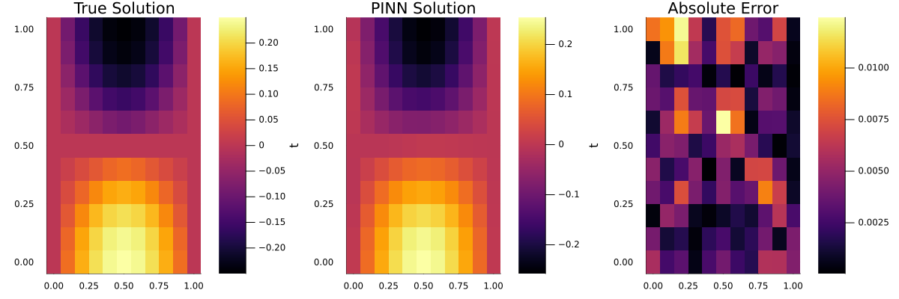

# Solving the 1D Wave Equation using Physics-Informed Neural Networks (PINNs)

This project solves the one-dimensional wave equation using a Physics-Informed Neural Network (PINN) implemented in Julia. PINNs embed the governing PDE, boundary conditions, and initial conditions into the loss function of a neural network, allowing for mesh-free, differentiable solutions.

---

## Problem Statement

We solve the following second-order wave equation:

∂²u/∂t² = ∂²u/∂x²

**Domain:**  

x ∈ [0, 1], t ∈ [0, 1]

**Initial conditions:**

u(x, 0) = x * (1 - x)
∂u/∂t(x, 0) = 0

**Boundary conditions:**

u(0, t) = 0
u(1, t) = 0

This represents a vibrating string fixed at both ends, initially shaped as a parabola, with no initial velocity.

---

## Analytical Reference Solution

The analytical solution via Fourier series expansion is:

u(x, t) = Σ (8 / (n³π³)) * sin(nπx) * cos(nπt), for odd n = 1, 3, 5, ...

We use the first 10 odd terms (n = 1 to 19) to generate the reference solution for comparison.

---

## Methodology

- **Neural Network Architecture:**
  - Input: (x, t)
  - Output: u(x, t)
  - 2 hidden layers, 16 neurons each
  - Activation: tanh

- **Loss Function:**
  A combination of:
  - PDE residual loss
  - Boundary condition loss
  - Initial condition loss

- **Training:**
  - Optimizer: BFGS
  - Batch size: 100 collocation points per iteration
  - Domain sampling via `QuadratureTraining()`

- **PINN Tools Used:**
  - `NeuralPDE.jl` for symbolic PDE definition
  - `Lux.jl` for defining neural nets
  - `Optimization.jl` for training
  - `Plots.jl` for visualization

---

## Visual Results

We generate three side-by-side heatmaps:

1. **Exact solution**
2. **PINN prediction**
3. **Absolute error (|u_pred - u_true|)**

### Output:

---

## Results Interpretation

- The PINN solution accurately reproduces the analytical wave pattern.
- Boundary and initial conditions are well respected.
- Error is lowest near the center and increases slightly near the boundaries — typical for PINNs without adaptive sampling or residual weighting.
- No mesh or finite difference method was used — the neural network learned the full spatiotemporal solution purely from physics.

---

## Reflections

- PINNs offer an elegant and mesh-free way to solve PDEs, especially useful for problems with known physics but sparse data.
- The convergence behavior is sensitive to initialization and optimizer choice. BFGS worked well for this smooth, well-posed problem.
- The symbolic PDE definition in `NeuralPDE.jl` made the modeling pipeline modular and readable.

